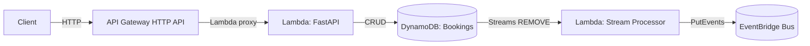

# Serverless Booking API (AWS SAM + FastAPI)
[](#)
[](#)

Serverless demo showcasing:
- API design with FastAPI on AWS Lambda (via Mangum)
- AWS Lambda Powertools (structured logging, tracing, metrics)
- DynamoDB with TTL-based reminders and Streams
- EventBridge integration for reminder events
- Infrastructure as Code with AWS SAM
- Local development with SAM CLI
- Tests (pytest) and CI (GitHub Actions)
- Pre-commit script (ruff, mypy, bandit)
- uv for package management

## Architecture

- Bookings stored in DynamoDB. GSI enables listing by user_id.
- TTL attribute (ttl) is set to “start_time - reminder_lead_seconds”.
- When TTL expires, DynamoDB deletes the item; its removal appears on the Stream.
- Stream processor emits a ReminderDue event to EventBridge.

## Endpoints

- POST /bookings
- GET /bookings/{booking_id}
- PUT /bookings/{booking_id}
- DELETE /bookings/{booking_id}
- POST /bookings/{booking_id}/cancel
- GET /users/{user_id}/bookings
- GET /health

## Local Development

Prereqs:
- AWS CLI, SAM CLI
- Python 3.11
- uv (pip install uv)

Install deps:
- uv sync --all-extras --dev

Run locally:
- uv export -o src/requirements.txt
- sam build
- sam local start-api

The API will be available at http://127.0.0.1:3000

Example:
- curl -X GET http://127.0.0.1:3000/health

## Deploy

- uv export --format requirements-txt \
  --no-dev \
  --no-editable \
  --no-hashes \
  --no-emit-project \
  -o src/requirements.txt
- sam build
- sam deploy --guided

*Example usage:* 
```bash
 curl -X POST http://localhost:3000/bookings -H "Content-Type: application/json" \
  -d '{"user_id":"u123","start_time":"2025-09-01T10:00:00Z","reminder_lead_seconds":3600}'
```


## Tests and checks

- ./tools/dev/pre-commit.sh

## Notes

- AWS Lambda runtime already includes boto3; pinned here for local/dev.
- You can add a custom EventBridge bus and restrict PutEvents if desired.

For production 
- Add auth (Cognito/JWT) and WAF on API Gateway, narrow CORS. 
- Tighten IAM (least privilege for EventBridge, etc.).
- Enable DynamoDB PITR and set table/log retention policies. 
- Add alarms and dashboards; verify tracing permissions. 
- Define CI/CD with staged environments and automated rollbacks. 
- Implement input validation, API versioning, and rate limiting. 
- Load test and set SLOs; review concurrency and idempotency.
